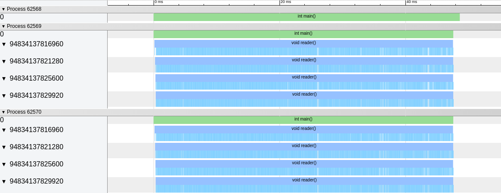

# prefork-workers

This is a great work in progress and is mostly for me to get insight in coroutines, pre-forking and creating simple workers. This will only work under Linux on an x86_64 architecture.

and yes i am aware that the code is not perfect...

## Coroutines

The *scheduler::addTask* adds a new task to the scheduler and runs the task as a stackfull coroutine.

The image below shows 4 tasks running but each task does not yield and as a consequence the tasks process one by one.

The image below the same 4 tasks running but here each task does yield and they run simultaneous

## Prefork

When applying pre-forking to the tasks we can run a scheduler on multiple cores. 

The image below shows 4 tasks running per process but each task does not yield and as a consequence the tasks process one by one.

The image below the same 4 tasks running per process but here each task does yield and they run simultaneous

## History

2020-11-26: initial commits  
2020-11-27: added memoryleak checking and chrome://tracing support  
2020-12-08: fixed the memory leaks